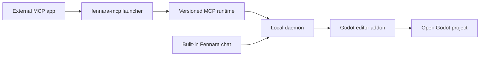

# Architecture

Fennara is a local bridge between AI clients and an open Godot editor project.
This page explains ownership, process boundaries, install layout, and update
handoff behavior.

| If You Need To... | Start Here |
| --- | --- |
| Find the source for a component | [Repo Map](repo-map.md) |
| Install or update Fennara | [Setup](setup.md) |
| Understand release artifacts | [Release Process](release.md) |
| Inspect the available model tools | [Tools](tools.md) |

There is no Fennara cloud service in the normal OSS path. An external MCP app
starts the local MCP process, which talks to the daemon. The built-in chat talks
to that daemon directly. The daemon reaches the Fennara addon in the open Godot
editor.



## Main Pieces

| Piece | Where It Lives | What It Does |
| --- | --- | --- |
| CLI | `local/crates/fennara-cli/` | Installs the addon into a Godot project, updates local packages, writes project guidance, and configures MCP apps through `fennara mcp-setup`. |
| MCP launcher | `local/crates/fennara-mcp/` | Stable executable that MCP apps call. It finds the active version and starts the runtime. |
| MCP runtime | `local/crates/fennara-mcp/` | Speaks MCP over stdio and forwards tool calls to the local bridge. |
| Daemon launcher | `local/crates/fennara-daemon/` | Stable executable used to start the active daemon runtime. |
| Daemon runtime | `local/crates/fennara-daemon/` | Keeps local state, coordinates with Godot, serves the MCP runtime, and hosts built-in chat routes. |
| Chat UI source | `ui/chat/` | HTML, CSS, and JavaScript for the built-in chat, settings, provider setup, MCP app setup, and update UI. It is synced into the packaged addon under `godot_demo/addons/fennara/dist/`. |
| Godot addon | `godot_demo/addons/fennara/` | The addon payload copied into user projects. |
| Runtime helper source | `runtime/` | Godot-side runtime helper scripts synced into the addon payload for runtime sessions and runtime scripts. |
| GDExtension | `fennara-cpp/` | Godot-facing tools, dock UI, diagnostics, validation, runtime capture, and editor integration. |
| Tool schemas | `local/schemas/tools/` | Shared model-facing tool contracts. The MCP runtime and built-in chat each select the schemas they expose. |

## Native Update Handoff

The chat UI requests update preparation through the daemon and the bound Godot
bridge. The native `UpdateCoordinator` launches the installed CLI, follows the
durable operation state, and presents progress without depending on the
webview after preparation begins.

Verified addon files are staged under
`.godot/fennara-update/<operation-id>/`. After explicit confirmation, a detached
CLI waits for the exact Godot PID and start time to disappear. It rechecks a
digest covering the complete staged addon, snapshots both shared launchers and
the runtime manifest, moves the active addon to `previous-addon`, moves the
staged addon to `addons/fennara`, and reopens the same editor project.
The reopened GDExtension writes an activation handshake. The CLI deletes the
backup only after the success receipt, handshake, and matching daemon health
are durable. Otherwise the receipt remains `recovery_required` and rollback
restores the previous addon, launchers, and runtime manifest. If interruption
temporarily leaves the addon unable to load, the installed CLI remains outside
the project addon and provides `fennara recover --project <path>` as the
single-addon emergency recovery entry point.

## In-Editor Chat Webview

The optional chat dock is hosted by the GDExtension UI layer. The shared host
contract separates two browser surface styles:

| Platform Path | Behavior |
| --- | --- |
| Windows | Native WebView2 child/overlay attached to the Godot editor window. |
| macOS | Native WKWebView attached to the Godot editor window. |
| Linux | CEF off-screen rendering into an internal Godot `TextureRect`, using a shared CEF runtime from Fennara app data. |

Users can also set Chat Settings to open the built-in chat in their system
browser next time. In that mode the Godot dock shows an **Open chat** fallback
panel and serves the same chat UI from the local daemon at `127.0.0.1` with the
owning editor's `chat_token`. This changes the display surface only; provider
settings, chat history, project scope, snapshots, tool execution, and external
MCP routing stay on the same daemon paths.

`fennara install`, `fennara update`, and `fennara doctor` report webview
prerequisites for the current platform. Windows warns when Microsoft Edge
WebView2 Runtime is missing, macOS reports the system WebKit.framework status,
and Linux validates the release-managed shared CEF runtime. These checks affect
only the optional built-in chat dock; MCP tools continue to work without a
native webview.

The Linux path renders browser pixels inside a Godot `Control` and routes the
CEF message loop through the dock process hook. The GDExtension discovers the
shared CEF runtime, validates its `fennara-cef-runtime.json` marker and
required files, dynamically opens `libcef.so`, then dlopens the small
`libfennara_linux_cef_bridge.so` addon library through a focused bridge loader.
That bridge is built from the
pinned official CEF 139 `libcef_dll_wrapper` source and owns the C++ CEF
objects (`CefClient`, `CefRenderHandler`, `CefRefPtr`) used to initialize CEF in
windowless mode, create the browser for the packaged chat URL, and copy paint
buffers into a Godot texture. Full IME, clipboard, and cursor handling are
separate follow-up work. The CEF runtime is intentionally separate from the
Godot addon zip: Linux installs use a shared app-data runtime location and the
CLI installs the release-managed CEF asset there once per user.

Multiple Godot editors may be open at the same time. Each embedded chat
websocket is accepted with the owning editor's `chat_token` and remains bound to
that Godot session for chat storage scope, snapshots, tool execution, cancel,
and revert. External MCP clients still route through the daemon's active target.
Chat provider settings are global for now, while chats remain project-scoped.
Cloud chat providers use locally stored API keys; local providers use base URLs
stored by the daemon. The current built-in chat provider set is OpenAI,
Anthropic, OpenRouter, Ollama Cloud, DeepSeek, Z.AI, Moonshot AI, Kimi For
Coding, MiniMax, local Ollama, and LM Studio. Ollama defaults to
`http://127.0.0.1:11434`; LM Studio defaults to `http://127.0.0.1:1234/v1`.
The daemon chat runtime resolves selected models through a small provider catalog
before making requests. Canonical model refs use `provider/model`.
OpenRouter is the main exception users notice because OpenRouter model slugs
often already contain a provider segment. Prefer
`openrouter/google/example` in Fennara; if a user pastes a raw OpenRouter slug
such as `google/example`, the daemon still routes it to OpenRouter for
compatibility. Native `openai/...` and `anthropic/...` refs use the official
providers; use `openrouter/openai/...` or `openrouter/anthropic/...` for those
vendors through OpenRouter. Providers share OpenAI-compatible or
Anthropic-compatible chat adapters where possible, with provider quirks isolated
in provider modules and normalized stream/error events above the adapter
boundary.

Built-in chat turns also write a local-only diagnostic trace into the same
`chat.sqlite` app-data database, in `chat_trace_events`, separate from transcript
tables. Trace rows use stable turn/generation/tool/bridge IDs plus timings,
statuses, counts, and bounded summaries; raw prompts and full tool results are
not captured by default. The daemon exposes a small local debug read endpoint at
`/chat/traces` for filtering by `chat_id`, `trace_id`, `turn_id`, or
`generation_id`.

## Install Layout

For the default Asset Library flow, the GDExtension first presents a native
setup panel when the exact local installation is missing. Its bootstrap bridge
downloads the addon version's release manifest and CLI archive with Godot's
HTTP client, verifies the declared SHA-256, and places only the CLI in Fennara
app data. It then launches `fennara install` and reads the durable operation
state for progress and diagnostics. Chat and the webview remain inactive until
setup succeeds and the matching daemon connects.

On macOS, user-facing documentation recommends installing through the CLI. The
in-editor bootstrap can run only after the GDExtension native library loads, so
it cannot remediate a Gatekeeper block caused by manually downloading and
extracting the non-notarized addon ZIP. Users whose manually copied addon is
blocked must remove it before running `fennara install`, because the CLI
preserves a complete existing addon.

A shared app-data bootstrap lock serializes CLI download and activation across
concurrent Godot editors. Lock ownership transfers to the launched installer
process, so another editor waits until that exact process exits. The panel
generates an operation ID, passes it to the CLI, and reads only that operation's
state file. If the child exits with a nonterminal state, the panel reports a
stable failure instead of waiting indefinitely.

The terminal install scripts remain the non-interactive and recovery path.

The install script installs the small outer CLI and adds it to `PATH`. After
that, modern releases can update the installed CLI through `fennara update` or
`fennara self-update`; rerun the install script only when CLI self-update is not
available for the selected release or install location.

After that, `fennara install` or `fennara update` fetches the release manifest,
verifies referenced asset hashes, downloads release assets, and sets up the
local package layout.

```text
Fennara/
  bin/
    fennara
    fennara-mcp
    fennara-daemon
  daemon-control-token
  current.json
  versions/
    <version>/
      fennara-mcp-runtime
      fennara-daemon-runtime
      addon/
        addons/
          fennara/
  webview/
    cef/
      linux-x64/
        <cef-version>/
```

On Windows, executables use `.exe`.

The daemon creates `daemon-control-token` with secure random bytes on first
start. Privileged local HTTP routes and the Godot bridge websocket require this
token through the `X-Fennara-Control-Token` header. The MCP runtime and Godot
addon read the token from the same per-user Fennara app-data directory. Before
sending the token, each client sends a random nonce to the public control
challenge endpoint and requires a valid HMAC-SHA256 proof. This prevents a
different process that owns the fixed port from collecting the reusable token.
Static chat assets and the minimal health endpoint remain public on loopback;
project chat websocket and media requests continue to use the owning editor's
separate project chat token.

The `webview/cef/...` directory is for read-only browser engine payloads shared
by every Godot project/editor using that Fennara install. Per-process writable
CEF profile, cache, and log data must stay outside that shared runtime payload
under `cache/webview/profiles/cef/godot-<pid>-<timestamp>-<nonce>/` and
`logs/webview/cef/godot-<pid>-<timestamp>-<nonce>/`.

Default platform locations:

| OS | Base Directory |
| --- | --- |
| Windows | `%LOCALAPPDATA%\Fennara` |
| macOS | `~/Library/Application Support/Fennara` |
| Linux | `~/.local/share/fennara` |

## Project Layout

When a user runs this inside a Godot project:

```bash
fennara install
```

the CLI copies the release addon into this layout when no complete addon is
already present:

```text
<godot-project>/
  AGENTS.md
  addons/
    fennara/
      ai/
        guidelines.md
```

When a complete addon is already present, the CLI validates its `VERSION` and
current-platform editor library, installs the exact matching local package, and
leaves the addon directory unchanged. The shared daemon is started only when it
is not already running, and install succeeds only after its health response
reports the addon version.

After Godot's editor filesystem scan completes, the addon immediately starts a
plugin-owned worker that prepares C# support. The worker runs one isolated
incremental build without blocking the Godot main thread. C# tool workers wait
on the same preparation barrier. The daemon only transports tool calls and does
not own the build process. All plugin-owned C# builds share one coordinator
because diagnostic and runtime builds reuse Godot's intermediate MSBuild tree.

Targeted `.cs` diagnostics are not supported. Whole-project C# diagnostics use
one cancellable `dotnet build` with Godot's structured build logger. Its final
assemblies are redirected to isolated per-project diagnostic
output so the open editor does not reload them. If C# source changes while the
initial background build is running, that build finishes normally and the next
explicit project scan performs one forced refresh. Runtime session preflight
uses an explicit root `.csproj` Debug
build, matching Godot's pre-Play build shape, and writes the real
`.godot/mono/temp/bin/Debug` assembly before launch.

## MCP Setup

`fennara mcp-setup` edits MCP app config so the app can start the local
launcher.

Examples:

```bash
fennara mcp-setup --claude
fennara mcp-setup --codex
fennara mcp-setup --cursor
fennara mcp-setup --gemini
```

The config points at the stable `fennara-mcp` launcher in the Fennara `bin`
directory. The launcher reads `current.json`, then starts the matching
versioned runtime.

That keeps MCP app configs stable across updates.

This setup path is separate from the built-in chat provider path. MCP apps use
their own model account; the Fennara dock uses the provider configured in chat
settings.

## Tool Call Flow

```text
MCP client
  calls a Fennara tool
MCP runtime
  validates the request against local schemas
  forwards the call to the local daemon
Daemon runtime
  routes the request to the connected Godot project
Godot addon
  runs the Godot-aware tool through GDExtension
  returns a concise markdown result
MCP runtime
  sends the result back to the MCP client
```

The MCP client can read and write normal files by itself. Fennara tools focus on
Godot-specific feedback: scene structure, node properties, diagnostics,
validation, runtime state, screenshots, and editor-aware edits.

Built-in chat tool calls add one daemon-owned permission gate before forwarding
to Godot. The chat settings approval mode is either `ask` or `full_access`.
Read-only tools are allowed immediately. Project mutation and runtime execution
tools wait for a UI approval in `ask` mode and auto-run in `full_access` mode.
Hard safety checks inside the Godot tools, such as blocked internal addon paths,
still apply in both modes.

## Updates

`fennara update` is the normal project update command. It reads the installed
addon release identity, resolves stable latest or that addon's isolated staging
channel, and freezes the result to one exact version. It first checks
the version of that release manifest's per-platform CLI asset and, when newer,
stages that CLI, lets the old process exit, replaces the installed CLI, and
resumes with the same target. It then uses the same manifest-driven resolver and installer as
`fennara install`.

Native staging discovery caches validated channel pointers for five minutes in
shared Fennara app data and revalidates them with GitHub ETags. A missing
channel is treated as no staging update, while malformed or cross-channel data
fails closed and never replaces a valid cache entry.

It can update:

- the installed CLI and local runtime package
- the project addon
- generated project guidance in `AGENTS.md` and `addons/fennara/ai/guidelines.md`
- shared webview runtime assets needed by the current platform, such as Linux CEF
- webview prerequisite warnings for the optional built-in chat dock

It does not rewrite MCP app config. Run `fennara mcp-setup` again only when
adding a new MCP client, repairing that client's config, or changing the MCP
target app integration itself.

If an MCP app is currently running a launcher, the update may keep that launcher
and continue. The versioned runtime package is still updated, and future starts
use the version from `current.json`. Use `fennara update --no-self-update` only
when intentionally skipping the outer CLI check.

Shared activation supports one active Fennara version at a time. The daemon
rejects update shutdown while any other Godot project is still connected, which
prevents a version switch underneath another editor. Exact version packages,
the previous `current.json`, launcher snapshots, and the previous project addon
are retained until the reopened editor validates the new GDExtension.

The daemon currently allows one managed `runtime_session` scene globally across
all connected Godot editors. A start request runs in the selected or
chat-bound Godot project, but another running managed scene must be stopped
before starting a new one.

## Release Assets

Each public release publishes separate assets so installs can stay modular:

| Asset | Purpose |
| --- | --- |
| `fennara-cli-<platform>-<arch>-v<version>.zip` | CLI and stable launchers. |
| `fennara-release-local-<platform>-<arch>-v<version>.zip` | Versioned MCP and daemon runtimes selected by the release manifest. |
| `fennara-release-addon-v<version>.zip` / `fennara-addon-latest.zip` | All-platform Godot addon payload with every built GDExtension binary referenced by `fennara.gdextension`. |
| `fennara-webview-cef-linux-x64-<cef-version>.zip` | Linux-only shared CEF runtime installed once into Fennara app data. |
| `fennara-release-manifest-v<version>.json` | Schema-versioned install/update plan with asset names, hashes, minimum CLI version, and shared runtime declarations. |

The moving `latest` release is what normal users should install from. Versioned
releases such as `v0.2.8` stay available for pinning and debugging.

Linux CEF runtime payloads are not part of `fennara-addon-*`. They are selected
by the release manifest and installed once into the shared app-data
`webview/cef/linux-x64/<cef-version>/` directory.

CEF runtime installs stage into a temporary sibling directory, validate required
files and the runtime marker, then publish the completed version directory and
atomically update `current.json`. Existing editor processes keep using the
already-loaded runtime.

## Design Rules

- Keep tools primitive and game-agnostic.
- Let agents inspect the project before making assumptions.
- Prefer Godot API feedback over file-only guesses.
- Return concise markdown results that an MCP client can use directly.
- Keep launchers stable and move changing code into versioned runtimes.
- Keep the external MCP path local. The optional built-in chat dock uses local provider settings stored through the daemon, such as cloud provider API keys and local Ollama or LM Studio base URLs.
